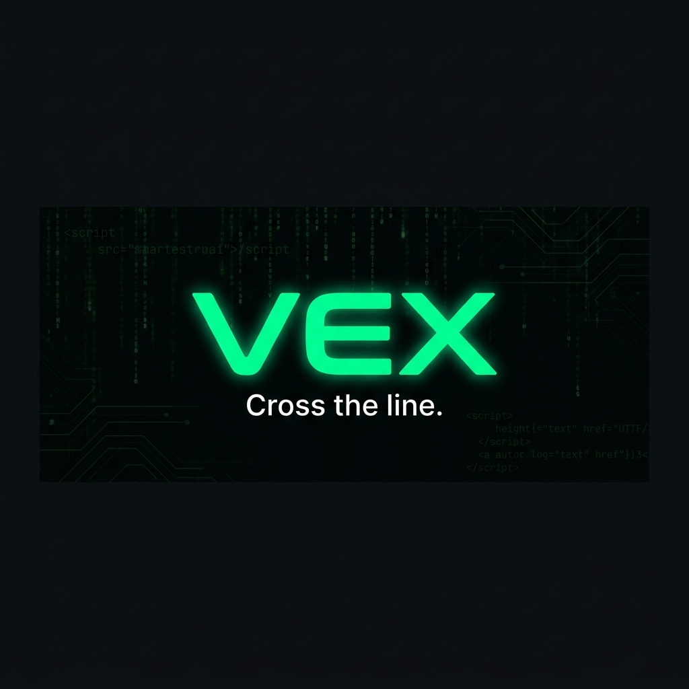

<p align="center">
  
</p>

<h1 align="center">Vex</h1>
<p align="center"><strong>Cross the line.</strong></p>

<p align="center">
  The ultimate XSS payload arsenal for security researchers, penetration testers, and bug bounty hunters.
</p>

<p align="center">
  <a href="https://vex-bay.vercel.app"></a>
  &nbsp;
  <a href="https://github.com/GENESIS-PROKEY/Vex"></a>
</p>

<p align="center">
  <a href="#features"></a>
  <a href="#tech-stack"></a>
  <a href="#tech-stack"></a>
  <a href="#tech-stack"></a>
  <a href="LICENSE"></a>
</p>

<br />

## About

**Vex** is an open-source, curated database of **940+ XSS payloads** built for security professionals. It combines a powerful search engine, advanced filtering, and a live DOM playground — all wrapped in a polished, themeable interface designed to feel like a proper security tool, not a spreadsheet.

Every payload is tagged with metadata: injection context, browser compatibility, WAF bypass targets, encoding type, difficulty level, and character count. This makes Vex the fastest way to find the exact payload you need during a penetration test or bug bounty hunt.

<br />

## Features

### Core

| Feature | Description |
|---|---|
| **940+ Payloads** | Curated XSS payloads across 12 categories — from basic `<script>alert(1)</script>` to advanced polyglot chains |
| **Fuzzy Search** | Powered by [Fuse.js](https://www.fusejs.io/) — search by description, payload content, tags, or category |
| **Advanced Filters** | Filter by category, difficulty, injection context, WAF target, encoding type, and character count |
| **URL-Synced State** | Every filter/search state is synced to the URL via [nuqs](https://nuqs.47ng.com/) — shareable, bookmarkable |
| **Live Playground** | Sandboxed DOM environment with vulnerable page presets to test payloads safely |
| **Syntax Highlighting** | Server-side highlighting with [Shiki](https://shiki.matsu.io/) — accurate HTML/JS token coloring |

### Interface

| Feature | Description |
|---|---|
| **12 Themes** | Cyberpunk, Dracula, Nord, Matrix, Monokai, Solarized, Blood Moon, Synthwave, and more — all persisted to localStorage |
| **Keyboard Shortcuts** | `⌘K` focus search · `T` cycle theme · `Esc` close modals |
| **Favorites** | Heart any payload — persisted to localStorage across sessions |
| **Export** | Download filtered payloads as `.txt` — one payload per line |
| **Deep Linking** | Share a specific payload via URL: `/payloads?id=...` |
| **Page Transitions** | Smooth Framer Motion animations between routes |
| **Scroll-to-Top** | Floating button with spring animation |
| **Custom 404** | Hacker-themed error page with glitch text and terminal styling |
| **PWA Ready** | Installable as a standalone app via `manifest.json` |

### Performance

| Feature | Description |
|---|---|
| **Content Visibility** | CSS `content-visibility: auto` on payload cards for paint containment |
| **Lazy Loading** | Intersection observer–based card rendering with progressive load |
| **Shimmer Skeletons** | Gradient shimmer loading states during page transitions |
| **Turbopack** | Next.js Turbopack for sub-second HMR in development |

<br />

## Tech Stack

| Layer | Technology |
|---|---|
| **Framework** | [Next.js 16](https://nextjs.org/) (App Router) |
| **UI** | [React 19](https://react.dev/) |
| **Styling** | [Tailwind CSS v4](https://tailwindcss.com/) (CSS-variable theming via `@theme`) |
| **State** | [Zustand](https://zustand-demo.pmnd.rs/) (with `persist` middleware) |
| **Search** | [Fuse.js](https://www.fusejs.io/) (fuzzy matching) |
| **URL State** | [nuqs](https://nuqs.47ng.com/) (type-safe query params) |
| **Animations** | [Framer Motion](https://www.framer.com/motion/) |
| **Icons** | [Lucide React](https://lucide.dev/) |
| **Syntax** | [Shiki](https://shiki.matsu.io/) (server-side highlighting) |
| **Language** | TypeScript (strict mode) |

<br />

## Getting Started

### Prerequisites

- [Node.js](https://nodejs.org/) 18.18+
- [npm](https://www.npmjs.com/) or [pnpm](https://pnpm.io/)

### Installation

```bash
# Clone the repo
git clone https://github.com/GENESIS-PROKEY/Vex.git
cd Vex

# Install dependencies
npm install

# Start development server
npm run dev
```

Open [http://localhost:3000](http://localhost:3000) to view the app.

### Build for Production

```bash
npm run build
npm start
```

<br />

## Project Structure

```
src/
├── app/                    # Next.js App Router pages
│   ├── changelog/          # Changelog timeline page
│   ├── docs/               # Documentation pages
│   ├── generator/          # Payload generator
│   ├── payloads/           # Main payload browser
│   ├── playground/         # Live DOM sandbox
│   ├── submit/             # Community payload submission
│   ├── layout.tsx          # Root layout (navbar, footer, providers)
│   ├── not-found.tsx       # Custom 404 page
│   └── globals.css         # Design system tokens + global styles
├── components/
│   ├── background/         # Matrix rain canvas
│   ├── filter/             # FilterBar + FilterSidebar
│   ├── home/               # HeroSection, Terminal, BountyStories
│   ├── layout/             # Navbar, Footer, ThemeApplier, PageTransition
│   ├── payload/            # PayloadCard, PayloadDetail, PayloadGrid
│   ├── playground/         # PlaygroundClient
│   └── ui/                 # SearchInput, CopyButton, Skeleton, ScrollToTop, Toast
├── data/                   # Payload database (JSON/YAML)
├── hooks/                  # Custom hooks (usePayloads, useCopyToClipboard, etc.)
├── lib/                    # Constants, utils, filter presets
├── store/                  # Zustand stores (theme, filters, favorites, UI)
└── types/                  # TypeScript type definitions
```

<br />

## Themes

Vex ships with **12 built-in themes** — press `T` to cycle through them:

| Theme | Accent | Theme | Accent |
|---|---|---|---|
| 💚 Cyberpunk | `#00ff88` | 🌙 Midnight | `#58a6ff` |
| 🧛 Dracula | `#bd93f9` | ☀️ Solarized | `#b58900` |
| ❄️ Nord | `#88c0d0` | 🩸 Blood Moon | `#ff4444` |
| 🔥 Monokai | `#a6e22e` | 🌊 Ocean Deep | `#00bfff` |
| 🟢 Matrix | `#00ff41` | 🔶 Amber Glow | `#ffaa00` |
| 🎵 Synthwave | `#ff00ff` | 🧊 Arctic | `#66ddff` |

<br />

## Keyboard Shortcuts

| Shortcut | Action |
|---|---|
| `⌘K` / `Ctrl+K` | Focus search |
| `T` | Cycle theme |
| `Esc` | Close modal |

<br />

## Contributing

Contributions are welcome! Here's how to get started:

1. **Fork** the repository
2. **Create** a feature branch: `git checkout -b feat/your-feature`
3. **Commit** your changes: `git commit -m "feat: add new feature"`
4. **Push** to the branch: `git push origin feat/your-feature`
5. **Open** a Pull Request

### Submitting Payloads

You can submit new payloads by opening a PR with your payload added to the `src/data/` directory.

<br />

## License

This project is open source and available under the [MIT License](LICENSE).

<br />

## Inspiration & Credits

Vex was inspired by the idea that XSS payload resources shouldn't be stuck in outdated cheat sheets and scattered GitHub gists. There should be a modern, searchable, beautifully designed tool for it — and that's what Vex is.

**The original inspiration:**
- **[XSSNow](https://xssnow.in)** — The project that sparked the idea. Seeing how XSSNow organized and presented XSS payloads made me want to build something similar with a modern tech stack, advanced filtering, and a design that feels like a real security tool. Vex wouldn't exist without XSSNow showing me what was possible.

**Payload research and data sources:**
- **[XSS Cheat Sheet by PortSwigger](https://portswigger.net/web-security/cross-site-scripting/cheat-sheet)** — The gold standard for XSS reference. Vex aims to make that depth of knowledge searchable and interactive.
- **[PayloadsAllTheThings](https://github.com/swisskyrepo/PayloadsAllTheThings)** — A massive community-driven payload repository that showed the value of organized, categorized payloads.
- **[OWASP XSS Filter Evasion](https://cheatsheetseries.owasp.org/cheatsheets/XSS_Filter_Evasion_Cheat_Sheet.html)** — The foundational reference for WAF bypass techniques.
- **[HackTricks XSS](https://book.hacktricks.wiki/en/pentesting-web/xss-cross-site-scripting/index.html)** — For advanced context-specific injection patterns.
- **[Brute XSS](https://brutelogic.com.br/blog/)** — Brute Logic's research on creative XSS vectors was a constant source of inspiration.

**Design and UI inspiration:**
- **[Shadcn/ui](https://ui.shadcn.com/)** — Component design philosophy and dark-mode aesthetics.
- **[Linear](https://linear.app/)** — Clean, keyboard-driven interface design.
- **[Vercel Dashboard](https://vercel.com/)** — Proving that developer tools can be beautiful.

Security tools don't have to look like they're from 2005. Vex is proof.

<br />

---

<p align="center">
  <sub>Built with 💚 by <a href="https://github.com/GENESIS-PROKEY">Genesis Prokey</a></sub>
  <br />
  <sub>If Vex helps your workflow, consider giving it a ⭐</sub>
</p>
